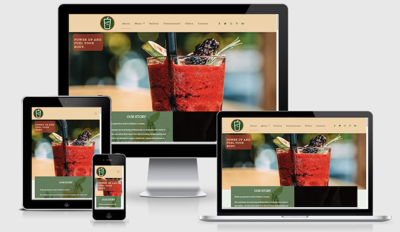

## SHAKE UP! ##

‘SHAKE UP!’ is a website for a place selling the healthiest and tastiest shakes in London. The aim of this website is to attract new customers, as well as to keep existing customers engaged and wanting to return.

## 1. USER EXPERIENCE (UX)

**1.1. STRATEGY**
The main goal of this website is to promote Shake Up which sells healthy and tasty shakes mainly alongside a few other secondary products; to keep existing customers engaged and attract new customers. The overall objective of this website is to create an established brand and as a result to achieve more sales.

**1.2. SCOPE**
This section determines what a potential or existing customer expect from interaction with the website.
Please find the scenarios of actions each type of visitor below wishes to take, depending whether they are first time visitors, returning or a frequent customers.

**User stories**
- Website User Goals
	- as a Website User, I want to easily navigate through the website.
	- as a Website User, I want the website to be organised and consistent across all device sizes.
	- as a Website User, I want all external links to be opened in a new tab so I don’t have to find my way back to the main page.
	- As a Website User, I want to see consistent behaviour so I have a pleasant journey when navigating through the page.

-  First Time Visitor Goals
	- as a First Time Visitor, I want to understand immediately what the website offers. 
	- as a First Time Visitor, I want to read about the company and learn more about the products.
	- as a First Time Visitor, I want to see the shake bar menu so I am prepared for my first visit.
	- as a First Time Visitor, I want to see what the place looks like inside to assess if the atmosphere is right for me and my expectations.
	- as a First Time Visitor, I want to see customer reviews to get to know what others thinks of the place and how they rate it.
	- as a First Time Visitor, I want to see the location of the place so I can check my journey and how to get there.
	- As a First Time Visitor, I want to see the opening times so I can make sure the place is open when I visit.
	- As a First Time Visitor, I want to be able to download the menu so I can print it out if I'd like to do so, or to share with my colleagues so they can choose menu items for themselves.

- Returning Visitor Goals

	- As a Returning Visitor, I want to be able to contact the place with any query I may have.
	- As a Returning Visitor, I want to see the links to social media so I can interact with other customers and see what else is happening. 
	- As a Returning Visitor, I expect to join a loyalty programme or to get discounts

- Frequent Visitor Goals
	- As a Frequent Visitor, I want to be a part of a loyalty programme and receive regular promotions/discounts 
	- As a Frequent Visitor, I want to be notified if there are any product launches, changes to the menu, or any other updates.
	- As a Frequent Visitor, I want to be engaged and make my contribution towards the product launches / I want my opinion to count.

**1.3. STRUCTURE**

Simplicity and consistency while keeping in mind user-friendly design was the strategy for the look of this website. Design is based on most modern look and feel for a single page structure.

This is a website with a single scrolling page with 6 separate page areas as follows:
- Home / About
- Menu
- Gallery
- Testimonials
- Offers
- Contact

Navigation menu has got links to each of the page sections, which makes it easy to navigate.
The ‘Menu’ section has got a downloadable menu if user prefers to view it this way.
Both, the header and the footer have links to social media.
The footer includes some key information, such as opening times, contact details and links to social media. Users can also download the menu from the footer.

**1.4. SKELETON**

The aim here was to outline the basic structure of the project according to what users really need, in order to get the best out of visiting this page, bearing in mind the priority of information being presented.

Wireframes were firstly sketched on a whiteboard. This method helped with brainstorming, deciding the most essential parts of the website, and getting the feel for the website as a whole.

Please find the links to sketched wireframes below:

- [Header and footer on desktop, whiteboard wireframe](/workspace/shake-up-milestone-one/assets/images/wireframes/whiteboard-header-and-footer-desktop.jpg)
- [Header and footer on mobile, whiteboard wireframe](/workspace/shake-up-milestone-one/assets/images/wireframes/whiteboard-header-and-footer-mobile.jpg)
- [About on mobile and desktop, whiteboard wireframe](/workspace/shake-up-milestone-one/assets/images/wireframes/whiteboard-about-desktop-and-mobile.jpg)
- [Menu on mobile and desktop, whiteboard wireframe](/workspace/shake-up-milestone-one/assets/images/wireframes/whiteboard-menu-desktop-and-mobile.jpg)
- [Gallery on mobile and desktop, whiteboard wireframe](/workspace/shake-up-milestone-one/assets/images/wireframes/whiteboard-insta-desktop-and-mobile.jpg)
- [Testimonials on mobile and desktop, whiteboard wireframe](/workspace/shake-up-milestone-one/assets/images/wireframes/whiteboard-reviews-desktop-and-mobile.jpg)
- [Offers on mobile and desktop, whiteboard wireframe](/workspace/shake-up-milestone-one/assets/images/wireframes/whiteboard-offers-desktop-and-mobile.jpg)
- [Contact on mobile and desktop, whiteboard wireframe](/workspace/shake-up-milestone-one/assets/images/wireframes/whiteboard-contact-desktop-and-mobile.jpg)

[Balsamiq](https://balsamiq.com/)  (provide hyperlink) was the tool used in this project to finalise previously sketched wireframes. Below are low fidelity wireframes.

- [Mobile wireframe](/workspace/shake-up-milestone-one/assets/images/wireframes/balsamiq-mobile-wireframe.pdf)
- [Tablet wireframe](/workspace/shake-up-milestone-one/assets/images/wireframes/balsamiq-tablet-wireframe.pdf)
- [Desktop wireframe](/workspace/shake-up-milestone-one/assets/images/wireframes/balsamiq-desktop-wireframe.pdf)

Note: Throughout the design phase some elements of the design changed to allow for a better user experience; i.e tablet wireframe included, however with a very few differences in comparison with the mobile wireframe – difference in size of objects.

## 1.5. SURFACE 
This section defines the visual language of the website.
### Design 

**Colour Scheme**

These are the colours I decided to use for my website: [https://coolors.co/167709-c03221-f7f7ff-f2d0a4-545e75](https://coolors.co/167709-c03221-f7f7ff-f2d0a4-545e75)

The green (#167709) colour was chosen to create a refreshing feeling and sense of healthy lifestyle. People feel safe with green colour.

I  selected complimentary colours, in order for the users to have a more exciting or joyful experience when navigating through. 

#F2D0A4 colour (Peach colour) was mainly used for the header and footer backgrounds, as well as for the main section headings, so the user can instantly recognise the main headings. The colour peach is known to be an excellent colour for communication, it also has much influence on good manners and calm. It gives a feeling of joy.

#C03221 (International Orange colour) was used on hovered icons. Similar to a Lava Red colour, it brings more warms and vibrancy onto the website. 

**Language / Tone**
I wanted it to be casual and fun, hence the decision about implementing fun descriptions under the Shake Menu items. 

## 2. FEATURES

### 2.1. Existing features

**The Header**:
-  Logo - Shake Up has it's own logo and identity. There is a name of the place inside of the logo, so users can instantly recognise the 'Shake Up' brand.
- Navigation bar - includes About, Menu Gallery, Testimonials, Offers and Contact Section. Under menu dropdown there is an option to download the menu. On the right hand site are social links. Upon hovering, they change colour to darker red.
Aim of navigation bar is for users to easily and intuitively navigate through the website. 
The navigation bar is toggled on small devices.
- Under the header, users will see the main image as soon as they enter the site with a 'Shake Up' motto. The image is animated - uses backwards image zoom. 

**The Footer**  includes:
- 'Shake Up' name and a short description.
- Icon to download a menu
- Opening Hours
- Contact Details: Address of the place, phone number as well as email address.
- Links to social media, that are also in the header. As this is a fictional shake bar, the links are taking the user to the main page of each of the social media platforms. 

The above information is grouped into 3 different columns on medium and larger devices, with the list to social links in the bottom middle of the screen. On small devices, it all goes into one column, with social media links moving to the bottom of the 'Contact Us' column, therefore staying on the bottom of the screen. 

Both the Header and the Footer are have the same colour to maintain good user experience. All links open in separate tabs.

**About section**  includes:

- 'Our Story' - provides information on when the Shake Bar was opened and who visits. It also lets the user know how the menu is maintained and updated. 
- 'Our Ingredients' -  describes the ethos of the place and provides information about products.
-  This section is using Bootstrap grid system - on small devices, all columns are put together, vertically.

**Menu section**  includes:
- Menu is divided into 4 main categories: Breakfast, Lunch, All Day, and shots, so everyone finds something for themselves, also depending on the time of the day. All Menu items have an image, so potential customers can get a feeling of what they would get in reality.
- Downloadable link, so the user can download the menu directly from the menu section.

**Gallery section**  includes:

- This section is linked to Instagram. User can see 6 photos of the place, and if they would like to view more, they can follow 'Shake Up' on Instagram.

**Testimonials section**  includes:

- 6 testimonial cards with two type of controls: arrows on left and right hand side, as well as control buttons below the testimonial card. On top of the review description, user can see the name of the person providing a review as well as their profession. Each testimonial has also got a rating. 

**Offers section**  includes:

- Two types of offers: one is a loyalty card where regular customer can get their 10th shake for free; another one is a student/NHS discount, offering 15% off.

**Contact section**  includes:

- Contact form implemented to let the user send any query they may have.
- Above 'Send' button, user can subscribe to a newsletter.

- Map - shows user the location of 'Shake Up". User can check how to get the place from their current location. 

**Features Still to Implement**

If this was a website promoting a real place, I would implement the following features:
- Make the fixed header transparent, so when user scrolls down, they can see through.
- Menu section: buttons with info about calories to be implemented.
- Video of the owner introducing the place in the 'About' section, to make the page more interactive. 
- Under the 'Gallery' section, next to 'Follow us on Instagram', I would include another option to 'Load More Pictures' should users not want to go to Instagram and instead prefer to view more pictures on the website. 
- Under 'Offers' section, a link to more offers which would take user to a separate page with shake .competitions for loyal customers, and more loyalty programmes.
- I would have included the links to real social media accounts.

## 3. TECHNOLOGIES

-  [Am I Responsive?](http://ami.responsivedesign.is/)  - used to preview my site across a variety of devices.
-   [Autoprefixer](https://autoprefixer.github.io/)  - used to parse the CSS and to add vendor prefixes to CSS rules.
- [Bootstrap 4.6](https://getbootstrap.com/docs/4.6/getting-started/introduction/)  - used to create the layout of the project and ensure consistency across different browsers.
- [Balsamiq](https://balsamiq.com/)  - used to create the wireframes.
-   [CSS3](https://en.wikipedia.org/wiki/Cascading_Style_Sheets)  - style sheet language used to style my website, and to customise the default Bootstrap behaviour.
- [Canva](https://www.canva.com/)  - used to design 'Shake Up" logo. 
- [Chrome Developer Tools](https://developers.google.com/web/tools/chrome-devtools) - to check responsiveness of the page, make temporary changes to make sure all sizes and spaces are correct, on different device sizes. 
-  [Font Awesome](https://fontawesome.com/)  - used the icons to provides more styles on the page including the social media links, testimonial arrows.
-   [Gitpod](https://gitpod.io/)  - used to develop the website.
-   [GitHub](https://github.com/)  - used to host the project.
-   [Google Fonts](https://fonts.google.com/)  - used to provide the fonts 'Zilla Slab', 'Roboto' (2nd option), sans-serif (3rd option) for the text.
- [HTML5](https://en.wikipedia.org/wiki/HTML5)  - markup language used to structure and present content for my website. 
- [StackEdit](https://stackedit.io/) - used to write my README.md file.
-   [Unsplash](https://unsplash.com/)  - used to download images for the project.
-   [TinyJPG](https://tinyjpg.com/)  - used to reduce the file size of my images.
- [W3C Markup Validation Service](https://validator.w3.org/) - to validate my HTML code.
- [W3C CSS Validation Service](https://jigsaw.w3.org/css-validator) - to validate my CSS file.

## 4. TESTING

The testing process can be found [here](assets/TESTING.md).

## 5. DEPLOYMENT

This site has been directly deployed from the master branch (steps in the following link have been followed: [https://docs.github.com/en/pages/getting-started-with-github-pages/configuring-a-publishing-source-for-your-github-pages-site](https://docs.github.com/en/pages/getting-started-with-github-pages/configuring-a-publishing-source-for-your-github-pages-site)) and hosted using GitHub pages.

**Steps that have been taken to deploy this website:**

1. Navigate to ‘shake-in’ repository ([https://github.com/Madeline8/shake-in](https://github.com/Madeline8/shake-in)).
2. Click ‘Settings’
3. In the left sidebar, click ‘Pages’.
4. Change to Master Branch, and click ‘Save’.
5. The page refreshes automatically and the project is deployed. 

**How to run the code locally:**
1. Go to the main page of the repository on Github.
2. Click 'Clone or download'.
3. Clone with HTTPS, and copy the URL. 
4. Open repo or create a new repo.
5. Open terminal.
6. Type `git clone` and paste [https://madeline8.github.io/shake-up-milestone-one/](https://madeline8.github.io/shake-up-milestone-one/)
 
More about the cloning process can be found in: [https://docs.github.com/en/github/creating-cloning-and-archiving-repositories/cloning-a-repository](https://docs.github.com/en/github/creating-cloning-and-archiving-repositories/cloning-a-repository)

## 6. CREDITS

**MEDIA AND CONTENT**

I took inspiration on what features, or what I need to include, from the following sources:
- https://www.getjuicedbar.co.uk/
- https://www.natas.london/

Most of the images were taken from https://unsplash.com/

I created my own **logo** on [this website](https://www.freelogodesign.org/): https://www.freelogodesign.org/ I signed up in order to create a free logo design.

I used the following resource to choose Shake Up motto: https://brandongaille.com/24-great-catchy-smoothie-shop-slogans/

I used this resource to move sections below the header as the top of each section was being hidden: https://pixelflips.com/blog/anchor-links-with-a-fixed-header

The following resources were used to decide on the colour scheme:
https://alphapedia.net/peach-color/
I used [http://colorsafe.co/](http://colorsafe.co/) to check whether text colour was complemented by the colour of the background.
https://www.color-meanings.com/shades-of-red-color-names-html-hex-rgb-codes/ - Lava Red colour.
[https://www.color-meanings.com/green-color-meaning-the-color-green/](https://www.color-meanings.com/green-color-meaning-the-color-green/).

- **Story / About**

Part of the content was taken from [https://www.getjuicedbar.co.uk/](https://www.getjuicedbar.co.uk/).
I learnt how to include responsive image with transparent text from [*W3Schools*](https://www.w3schools.com/howto/howto_css_image_transparent.asp).

- **Menu**

Some info shakes for the menu section was taken from [this page] : (https://www.bodybuilding.com/content/50-best-protein-shake-and-smoothie-recipes.html). 
Content about shots was found on [this page](https://dailyburn.com/life/recipes/health-boosting-wellness-shots-juice-recipes/): https://dailyburn.com/life/recipes/health-boosting-wellness-shots-juice-recipes/
Interior picture was taken from: [https://www.behance.net/gallery/68189015/Samba-cafe-interior](https://www.behance.net/gallery/68189015/Samba-cafe-interior) 

- **Gallery**

Lightbox:
**[https://www.w3schools.com/howto/howto_js_lightbox.asp](https://www.w3schools.com/howto/howto_js_lightbox.asp) –** I used lightbox for my gallery section. Links to connect to Ekko Lighbox I have taken from: [https://cdnjs.com/libraries/ekko-lightbox](https://cdnjs.com/libraries/ekko-lightbox) and [https://sharebootstrap.com/lightbox-for-bootstrap/](https://sharebootstrap.com/lightbox-for-bootstrap/)

- **Testimonials**

To implement carousel, I used the following resources: [https://www.youtube.com/watch?v=p3lmiRAdczg&ab_channel=DivinectorDivinector](https://www.youtube.com/watch?v=p3lmiRAdczg&ab_channel=DivinectorDivinector) and [https://getbootstrap.com/docs/4.6/components/carousel/](https://getbootstrap.com/docs/4.6/components/carousel/)

- **Contact**

I learnt how to put text on a faded image background from this website: [https://www.w3schools.com/howto/howto_css_image_text.asp](https://www.w3schools.com/howto/howto_css_image_text.asp)

## Acknowledgements**

I would like to thank: 
- My mentor, Precious Ijege for his guidance and support. 
- Tutor support at Code Institute for their help on issues I encountered throughout the project.
- My friend Antony, for his help with the testing on his devices, and the spelling check across the website. 