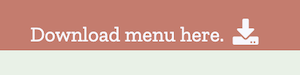

## 4. TESTING

- **Code Validation**

I used [W3C Markup](https://validator.w3.org/) and [CSS Validation Service](https://jigsaw.w3.org/css-validator/) by coping the contents from my index.html and style.css file and pasting into ‘Validate by Direct Input’ field.

I considered and tried adhering to what the validator suggests, however, I decided to ignore it in the end. When I was changing the size to % or px, the map did not take a full horizontal space on the page - it was too narrow. When I was testing my page the map looked correct on all devices, hence why I have decided to leave it as it is. 

Before validating my CSS file, I used [https://autoprefixer.github.io/](https://autoprefixer.github.io/) - it is a ‘Autoprefixer is a PostCSS plugin which parses CSS and adds vendor prefixes’.

I  reviewed all my comments, as well as made sure all curly braces have their closing tags. I found that just before line 647 there was an unnecessary "`*/`". This has fixed the error. The results once I have run the CSS validation again, looks like this:

I have also received some warnings:

Where the system warns me about the same background and border colour  - it was my design decision.
I have also received lots of warnings about an unknown vendor extension.  After some research (https://stackoverflow.com/questions/52490004/what-are-all-of-these-w3c-css-validation-warnings-about; https://stackoverflow.com/questions/18083056/what-are-moz-and-webkit) I understood that no further action is needed when it comes to those warnings. Vendor prefixes will help support browser compatibility efforts. As per the following resource https://www.sitepoint.com/community/t/css-validation-unknown-vendor-extensions/125616 "The validator only validates against valid code. The vendor extensions are proprietary code. As such it will always be invalid."

**Responsiveness / Device Compatibility**

I used [https://www.responsivedesignchecker.com/](https://www.responsivedesignchecker.com/) as well as Google Chrome DevTools [https://developer.chrome.com/docs/devtools/](https://developer.chrome.com/docs/devtools/) to make sure all layout is correct and the user has a pleasant experience when navigating through the page.

 -- Pixel 2XL - all works well.
-- iPhone5/SE - everything worked well except of one minor styling issue - carousel controls (arrows) were slightly too close to testimonial's content, as per the image below:
-- 
-- iPhone 6/7/8 - all works well.
-- iPhone 6/7/8 Plus - all works well.
-- iPhone X - a hamburger is positioned slightly too far to the right. This is because of the animation. I changed 	the animation of the main page image, under the navigation, to 'backwards' instead of 'forwards'. It fixed the issue. 
-- iPad - all works well.
-- iPad Pro - all works well.

All links on the page have been manually tested. They will open in a new tab using ‘target=”_blank”.

**Responsiveness - Browser Compatibility**

Site was tested across various browsers:

Google Chrome, Safari, Mozilla Firefox, Microsoft Edge and Opera everything has rendered correctly, no bugs.

Internet Explorer - everything worked well, apart from the 'About' section. The grid did not seem to be fully responsive. The screen was going too far to the right, the top right hand picture as well as the bottom left one seem to be too big. The content is not showing in 'our story'. 
https://stackoverflow.com/questions/39456030/internet-explorer-responsive-images-losing-aspect-ratio After research I understood that Internet Explorer looses aspect ratio of responsive images, and that it is not a coding problem. I tried fixing it by applying `max-width: 100%` to all images in that section, but it didn't work. I decided to leave it in order not to cause disruption on other browsers. Microsoft Edge will be fully replacing Internet Explorer from 2022. 

**TESTING USER STORIES FROM USER EXPERIENCE (UX) SECTION**

**Website User Goals**
- As a Website User, I want to easily navigate through the website.
	- Navigation bar is fixed and user can access it any time. Fixed navbar includes links to the main sections, as well as link to social media. In the footer, user can find the main info on what Shake Up offers, main contact details, as well as they can access a quick link to download Shake Up menu.
	
- As a Website User, I want the website to be organised and have consistent behaviour across all device sizes
	- The colour in navigation bar, as well as in the footer is consistent and the user can instantly recognise where to find the information and can easily navigate through. Using Bootstrap grid system allows all sections to be structured in the way that is predictable and follows well on all device sizes. 
	User will enjoy a simple layout and and consistent style across the page.
	
- As a Website User, I want all external links to be opened in a new tab so I don’t have to find my way back to the main page.
	- All links, including social media links a menu download are opened in the new tab. When user hover over the social media links, the change colour to a darker red.

**First Time Visitor Goals**
- As a First Time Visitor, I want to understand immediately what the website offers.
	- As soon as the user enters the website, they can see a 'Shake Up' logo, that has got a shake on it. The header also includes a main image of shake, with 'Shake Up' motto. The website was designed in the way that even if user doesn't click on the 'About' section, they can see that 'Our Story' comes up next (the right vh was set for the main image under the header), where they can read what the place offers. 
	

- As a First Time Visitor, I want to read about the company and learn more about the products.
	- In 'About' section, user can read about the story of the place, as well as understand more about the ingredients they use, and where they are coming from.
	
- As a First Time Visitor, I want to see the shake bar menu so I am prepared for my first visit.
	- User can access the menu on the website by either clicking on the 'Menu' link in the navbar, or if they prefer to scroll down the page, they will find the 'Menu' section right after 'About' section.
    
        
    
        
    
        

	Menu was designed using grid system, so it's clear and responsive on all devices. Menu was divided into 4 categories: Breakfast, Lunch, Dessert, and All Day, to help user with their choice of shake. Each menu item has got an image so the user can visualise what they'll get once they've bought the product. They also have the name which best describes the flavour, as well as description. 

- As a First Time Visitor, I want to be able to download the menu so I can print it out if I'd like to do so, or to share with my colleagues so they can choose menu items for themselves.
	- User can download the menu from 3 locations on the page: from the navigation bar, upon clicking 'Menu' -> 'Download Menu', the menu will be downloaded and shown in a new tab. They can also download the menu directly from the bottom of the menu section, as well as from the footer. 
	 
        

	    

	    
	
- As a First Time Visitor, I want to see what the place looks like inside to assess if the atmosphere is right for me and my expectations.
	- Gallery section shows some images of the place and its products. User can also follow the link to Instagram, should they wish to see more photos. As this website is fictional, the link currently takes user to the man Instagram page. 

        

	- User can also see more images (in the background) between 'Offers' and 'Contact' section.

        
	
- As a First Time Visitor, I want to see customer reviews to get to know what others thinks of the place and how they rate it.
	- User can access 'Testimonials' section, which contains user reviews - 6 testimonial cards. Each card has image of the reviewer, review content, their name and profession as well as the rating. Two types of controls in testimonials allow user to easily switch between the testimonials, as they wish. 
	
        
	- By accessing the TripAdvisor link either in the navigation bar or in the footer, the user can also find Shake's Up visitor's feedback.
	
        

-  As a First Time Visitor, I want to see the location of the place so I can check my journey and how to get there.
	-  'Contact' section in the footer informs the user of the Shake's Up location.
	
        
	- Just above the footer, user can find a screen wide Google Map with the Shake's Bar address on it too. User can click on 'Directions' on the map to check their journey to the place. User can also view a larger map in a new tab if they wish to do so.
    If it was a real place, user could use a Google Street View option, to see the surroundings where the Shake bar is located, and see it from outside. The place would also probably have other user Google images on the Internet, upon clicking on the place.

        
    - As a First Time Visitor, I want to see the opening times so I cam make sure the place is open when I visit.
	- User can find opening hours in the footer section.

        

**Returning Visitor Goals**

- As a Returning Visitor, I want to be able to contact the place with any query I may have.
	- User can contact the place either by:
	-- filling out the form in the 'Contact' section, which sits on the bottom of the page, above Google Map. If user doesn't fill out all information, they will be prompted to fill in the mandatory fields.
	
        
	-- Should user want to call the company instead of filling out the form, they can find the phone number in the footer. This is for quick enquires where a user would like to instantly get their answer.
	-- Email address is given in the footer if the user prefers to send a direct email, without having to fill out the form on the page.
	
- As a Returning Visitor, I want to see the links to social media so I can interact with other customers and see what else is happening. 
	- User can find the links to social media in the header as well as in the footer. In the footer the links to social media sit on the bottom of the page, on all: small, medium or large devices. Social media links include the links to the main pages (Facebook, Twitter, Instagram, Pinterest, TripAdvisor) since this is a fictional place. Links change their colour to a darker read when hovered.
	
        

- As a Returning Visitor, I expect to join a loyalty programme or to get discounts
	- Once the user clicks on 'Offers' in the header, it will take him to two main offer Shake Up currently has: Loyalty Card, as well as Student/NHS discount. 
	
        

**Frequent Visitor Goals**
- As a Frequent Visitor, I want to be a part of a loyalty programme and receive regular promotions/discounts.
	- Both, Returning or Frequent visitors, have the change to be a part of loyalty programme, and if they belong to NHS or are students, they would get 15% off their bill.
	
- As a Frequent Visitor, I want to be notified if there are any product launches, changes to the menu, or any other updates.
	-  User can subscribe to the newsletter by ticking the option to 'Subscribe to our Newsletter' in the contact form. Once subscribed, they would be receiving new offers, info about new shake recipes, or any events coming up.

    
- As a Frequent Visitor, I want to be engaged and make my contribution towards the product launches / I want my opinion to count.
	- User can leave their feedback or suggestions in the ‘contact’ section’. Also, by subscribing for the newsletter, they get notification about product launches or new offers.
	

**Known Bugs**

- in Testimonials section, I had a problem with alignment of the cards on smaller devices. They were going too far to the right side of the screen. I contacted tutor support with that and I worked out how to centre testimonial cards:  I targeted the .card class and overwrote the default margins that Bootstrap automatically adds to the cards. In the CSS file, I applied the following: `margin: 0 auto !important`. In order to leave the spacing as they are on larger devices, I decided to apply overwritten code to media queries for smaller devices, less than 768px. 

- Another issue related to the testimonials section, was that on smaller devices, the two active cards were vertically aligned on the screen. I wanted just one card at a time on small devices, not two. To fix this, I applied grid system to the carousel. 

- When I first created all the sections, I had not realised that HTML was not aligned; there was a big space on the right hand side. My mentor advised me to comment out everything and work step by step to find where the issue lay. This is what I did. However, I have not managed to recreate everything in one day and therefore I had to commit changes with uncommented code for the rest of the sections I created earlier, on Github. I am fully aware this is not ideal, however I hope this can be accepted, as long as the final push doesn’t have any unnecessary commented out code.

- My friend, upon testing my website, told me that the screen for some reasons keeps jumping, it was seen especially on a mobile device. I have worked out that this is due to carousel in testimonials section, and I decided that changing the size of testimonial cards to the same size might fix the issue. It fixed it to some degree - I still had to adjust image sizes of the people in testimonials, so they are exactly the same size. Upon testing again, it worked and the screen is not jumping.

[Go back to README.md file.](README.md)